## Requirements for Group Project
[Read the instruction](https://github.com/STIW3054-A221/class-activity-soc/blob/main/GroupProject.md)

## Group Info:

<table>
  <tr>
    <th>No</th>
    <th>Matric No</th>
    <th>Name</th>
    <th>Photo</th>
    <th>Phone Number</th>
  </tr>
  <tr>
    <td>1</td>
    <td>277364</td>
    <td>Ang Toon Ph'ng (Leader)</td>
    <td></td>
    <td>012-4037118</td>
  </tr>
  <tr>
    <td>2</td>
    <td>281279</td>
    <td>Low Xin Yin</td>
    <td></td>
    <td>016-4465836</td>
  </tr>
  <tr>
    <td>3</td>
    <td>281237</td>
    <td>Tan Zhi Yang</td>
    <td></td>
    <td>010-3620711</td>
  </tr>
  <tr>
    <td>4</td>
    <td>278466</td>
    <td>Ooi Jun Zhen</td>
    <td></td>
    <td>017-4764379</td>
  </tr>
  <tr>
    <td>5</td>
    <td>276917</td>
    <td>Ang Shu Khai</td>
    <td></td>
    <td>018-7904739</td>
  </tr>
</table>

## Title of your application
<h3>Telegram Bot Booking System: PNG Bot</h3>

## Introduction
In this day and age, virtual agents, also known as chatbots, are utilized to make abundances of tasks ranging from giving users reminders, booking rooms, to ordering pizza deliveries. In essence, the purpose of using a chatbot in this process is to streamline it into a straightforward discussion between the user and the machine, making it quicker and easier than navigating through several website options. People who are less familiar with computers should be able to utilise it in a way that they wouldn't be able to using the conventional methods since it should be highly straightforward.

The additional telegram bot booking system will be a great help for staffs who are not well-versed in using computers while still wanting to make a booking for a room in School of Computing(SOC) without having to physically go to there. This not only saves time for staffs but for ones who manages the booking as well.

## Flow Diagram of the requirements

## User manual for installing your application on Heroku Server
[User Manual For Installing Application On Heroku Server.pdf](https://github.com/STIW3054-A221/group-project-png/files/10461055/User.Manual.For.Installing.Application.On.Heroku.Server.pdf)

## User manual/guideline for testing the system
[User Manual.pdf](https://github.com/STIW3054-A221/group-project-png/files/10442345/User.Manual.pdf)

## Result/Output

<u><strong>Register User</strong></u>
 Command: /registeruser
 
 
 
 
<u><strong>User Login</strong></u>
 Command: /login
 <u>View Booking Details</u>
 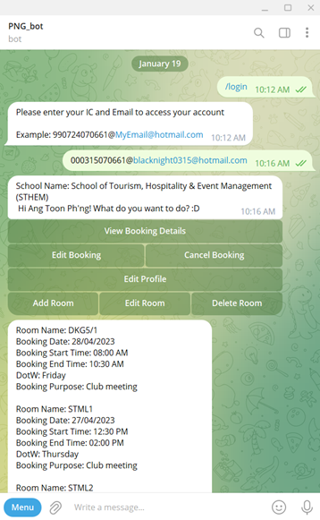
 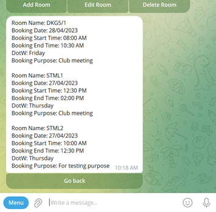
 <u>Edit Booking</u>
 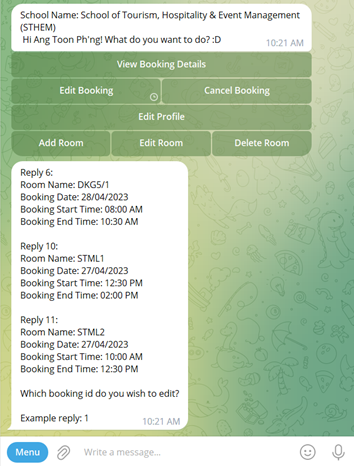
 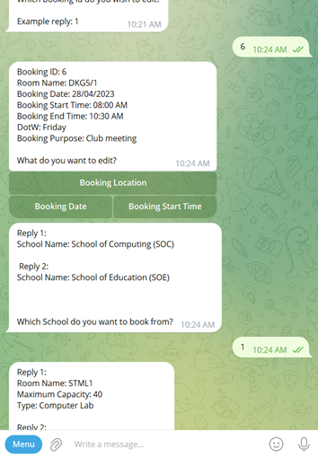
 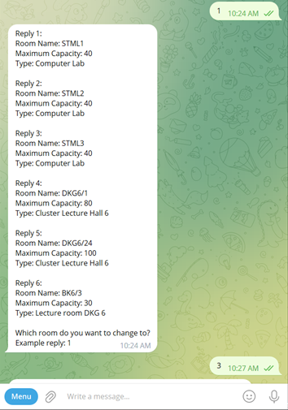
 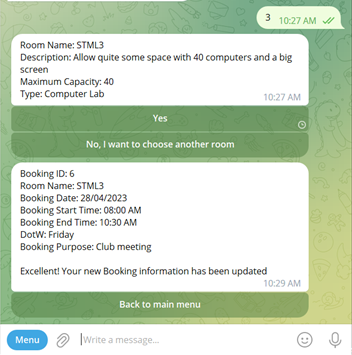
 <u>Cancel Booking</u>
 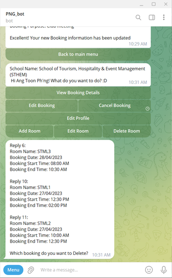
 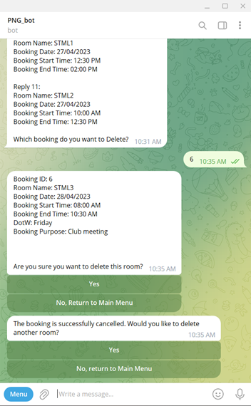
 <u>Edit Profile</u>
 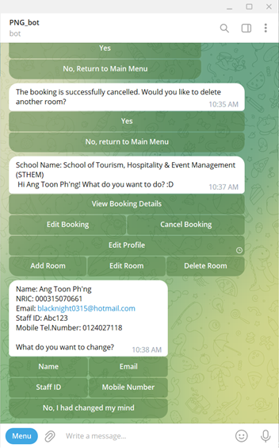
 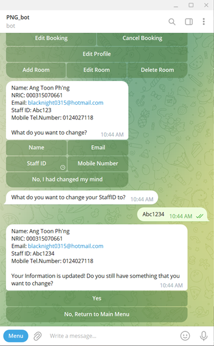
 <u>Add Room</u>
 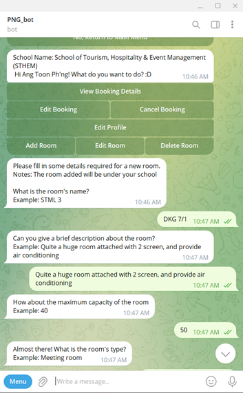
 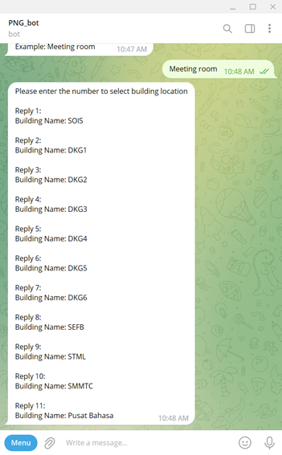
 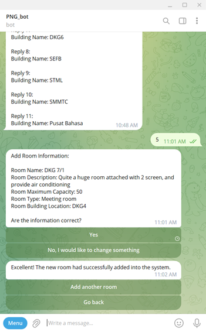
 <u>Edit Room</u>
 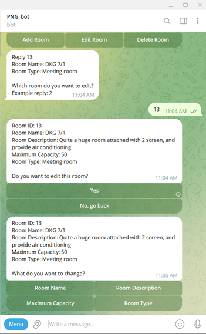
 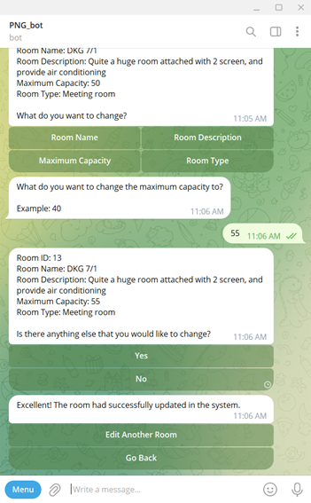
 <u>Delete Room</u>
 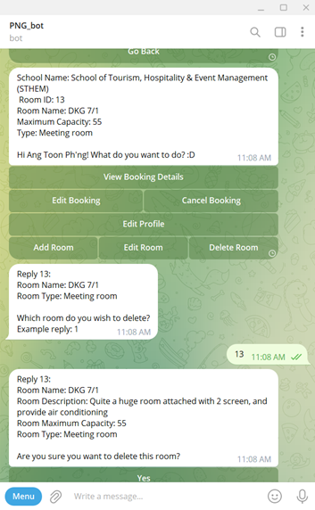
 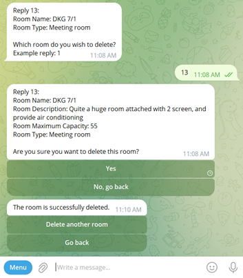
 
 
<u><strong>Booking A Room</strong></u>
 Command: /book
 
 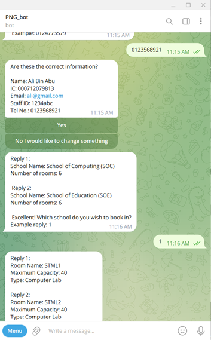
 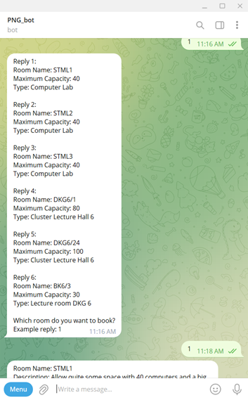
 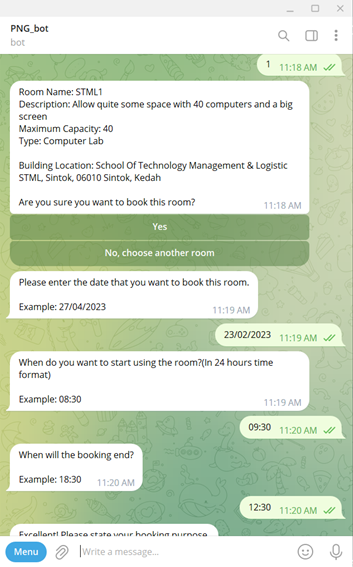
 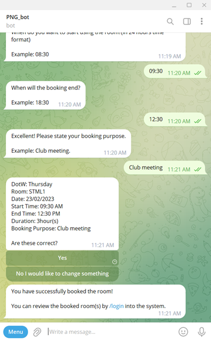
 
 
<u><strong>Available Room List Based On Date</strong></u>
 Command: /roomlist
 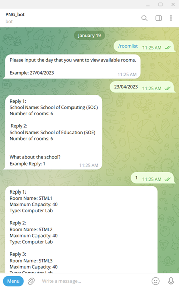
 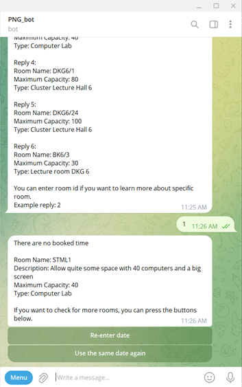
 
 
<u><strong>System Admin Access</strong></u>
 Command: /roomlist
 System admin verification code: A221 PNG BOT
 <u>View Booking List</u>
 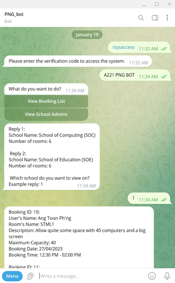
 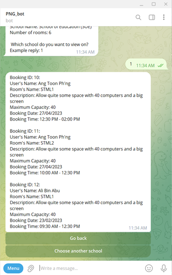
 <u>View School Admin</u>
 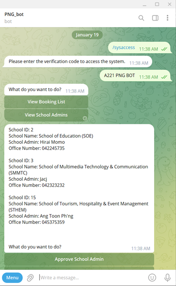
 <u>Approve School Admin</u>
 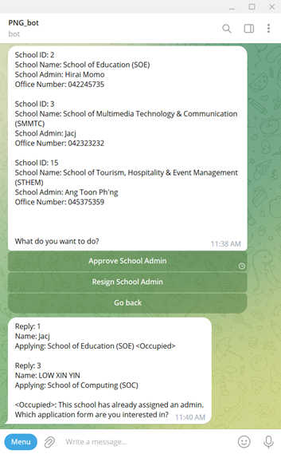
 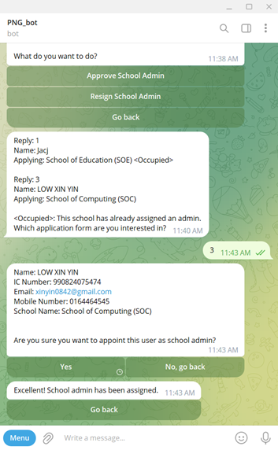
 <u>Resign School Admin</u>
 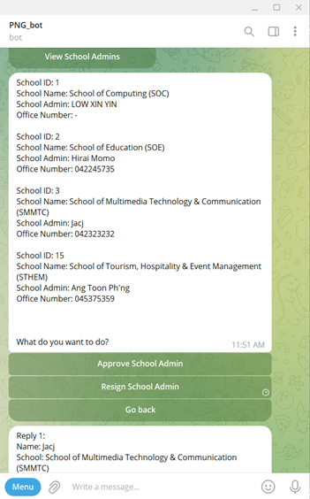
 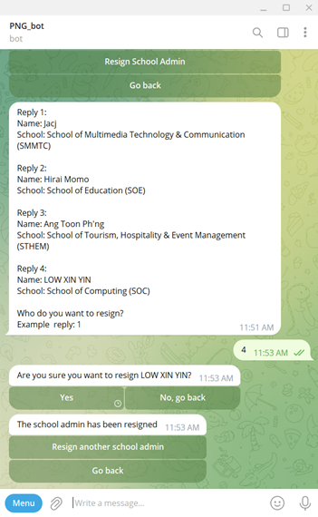

## Use Case Diagram

## UML Class Diagram

## Database Design

## Youtube Presentation
## References (Not less than 20)
<ol>
<li>Azamat Ordabekov. (2021). How to Create Telegram Bot in Java. YouTube. Retrieved December 10, 2022, from https://www.youtube.com/watch?v=XjOnp8TVNSQ.</li>
<li>Java Code Junkie. (2021). PreparedStatement | Jdbc Tutorial for Beginners. YouTube. Retrieved December 15, 2022, from https://www.youtube.com/watch?v=T0P-cfsD45o.</li> 
<li>RedSysTech. (2021). # 111 Internal Working of HashMap in Java | How HashMap works internally in java | Java | RedSysTech. YouTube. Retrieved December 12, 2022, from https://www.youtube.com/watch?v=HArvh9AZ1IE.</li> 
<li>Sebastian Daschner. (2022). Creating and using a Telegram Bot with Java. YouTube. Retrieved December 10, 2022, from https://www.youtube.com/watch?v=LCuC88s6m4k.</li> 
<li>SQLite Tutorial. (2021, April 10). Connect to the sqlite database using sqlite JDBC driver. Retrieved December 12, 2022, from https://www.sqlitetutorial.net/sqlite-java/sqlite-jdbc-driver/ </li>
<li>Cameron McKenzie. (2020). Multiple Values Per Key in Java Maps Example. YouTube. Retrieved December 13, 2022, from https://www.youtube.com/watch?v=6Zlo5Kf-CV4&amp;t=199s.</li>
<li>Class SimpleDateFormat. Java™ Platform Standard Ed. 7. (2020, June 24). Retrieved December 15, 2022, from https://docs.oracle.com/javase/7/docs/api/java/text/SimpleDateFormat.html </li>
<li>Crack Concepts. (2019). How To Join 3 Or More Tables In Sql | Two Ways. YouTube. Retrieved December 16, 2022, from https://www.youtube.com/watch?v=wdz4MRlzOyE. </li>
<li>Date format in java: Java simple date format. Edureka. (2022, November 29). Retrieved December 14, 2022, from https://www.edureka.co/blog/date-format-in-java/#:~:text=The%20DateFormat%20class%20in%20Java,Format%20classes%20are%20not%20synchronized. </li>
<li>JavaTPoint. (n.d.). Java convert string to date - javatpoint. www.javatpoint.com. Retrieved December 14, 2022, from https://www.javatpoint.com/java-string-to-date </li>
<li>Refsnes Data. (n.d.). Javascript string split(). JavaScript String split() Method. Retrieved December 11, 2022, from https://www.w3schools.com/jsref/jsref_split.asp </li>
<li>SendPulse Team. (2022, November 18). How to Create and Connect a Telegram Chatbot. SendPulse. Retrieved December 10, 2022, from https://sendpulse.com/knowledge-base/chatbot/telegram/create-telegram-chatbot </li>
<li>SQLite java: Select data. SQLite Tutorial. (2022, August 28). Retrieved December 13, 2022, from https://www.sqlitetutorial.net/sqlite-java/select/ </li>
<li>Using SimpleDateFormat for custom date formatting and parsing. (n.d.). Retrieved December 17, 2022, from http://web.cs.ucla.edu/classes/winter15/cs144/projects/java/simpledateformat.html </li>
<li>SQLite Tutorial. (2022, August 28). SQLite java: Deleting data. SQLite Tutorial. Retrieved December 19, 2022, from https://www.sqlitetutorial.net/sqlite-java/delete/</li>
<li>SQLite Tutorial. (2022, April 3). SQLite inner join with examples. SQLite Tutorial. Retrieved December 19, 2022, from https://www.sqlitetutorial.net/sqlite-inner-join/</li>
<li>SQLite Tutorial. (2022, August 28). SQLite java: Inserting data. SQLite Tutorial. Retrieved December 19, 2022, from https://www.sqlitetutorial.net/sqlite-java/insert/</li>
<li>SQLite Tutorial. (2022, August 28). SQLite java: Update data. SQLite Tutorial. Retrieved December 19, 2022, from https://www.sqlitetutorial.net/sqlite-java/update/ </li>
<li> Khan, I. (2021, October 18). Input validation in Java using scanner. Java2Blog. Retrieved December 28, 2022, from https://java2blog.com/input-validation-java/  </li>
<li>Stack Abuse. (2021). Java: Check if String is a Number. Retrieved January 10, 2023, from https://stackabuse.com/java-check-if-string-is-a-number/.</li>
<li>GeeksforGeeks. (2021, December 7). Daemon thread in Java. GeeksforGeeks. Retrieved January 12, 2023, from https://www.geeksforgeeks.org/daemon-thread-java/ </li>
<li>Isakovinc. (2022, June 22). Deploy java telegram bot on Heroku server. Medium. Retrieved January 18, 2023, from https://medium.com/@learntodevelop2020/deploy-java-telegram-bot-on-heroku-server-42bfcfc311d3 </li>
</ol>

## JavaDoc
https://xinyinlow.github.io/javaDoc-GroupPNG_bot/my/uum/package-summary.html
